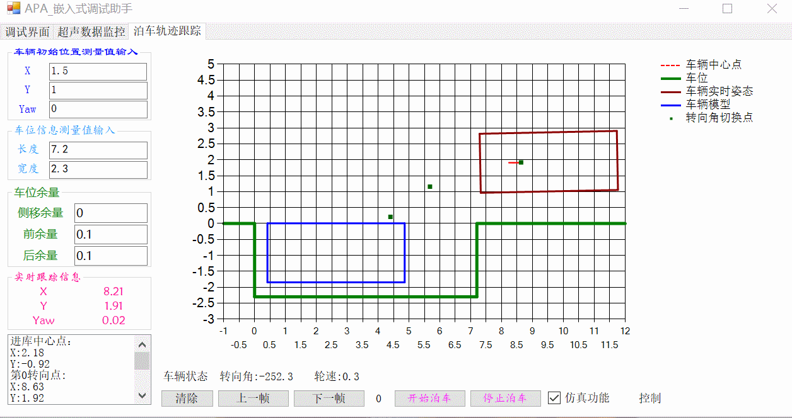
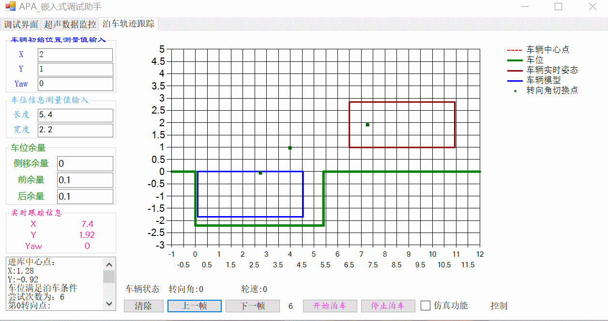
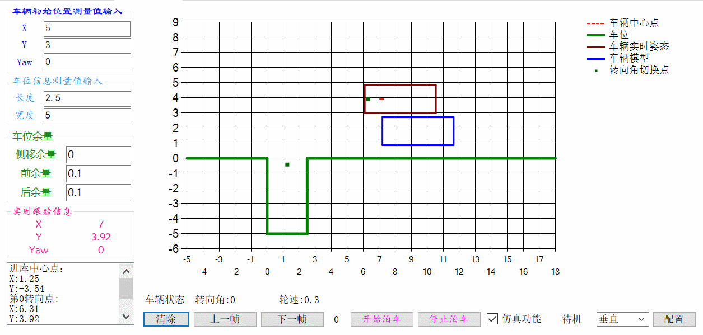
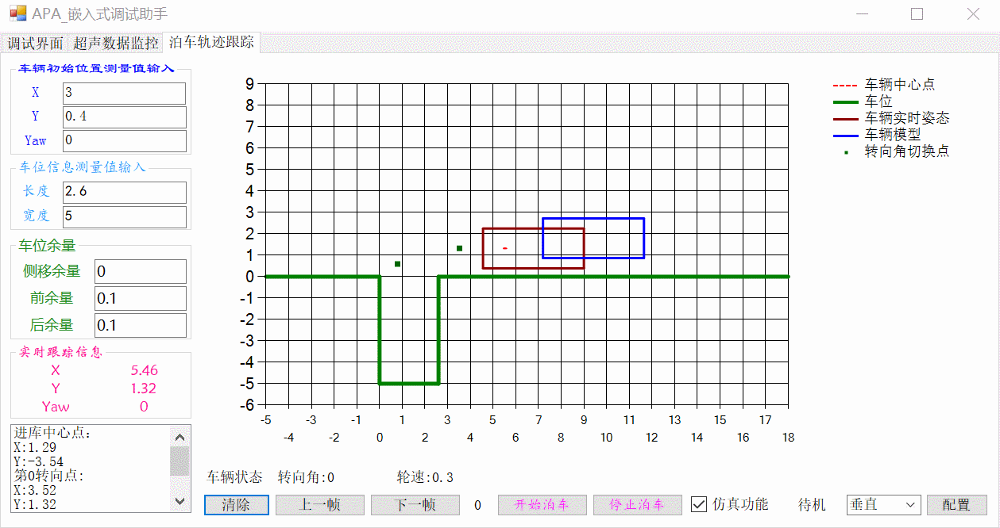
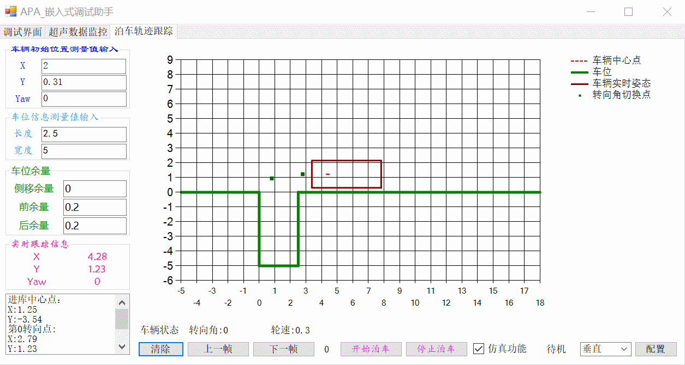
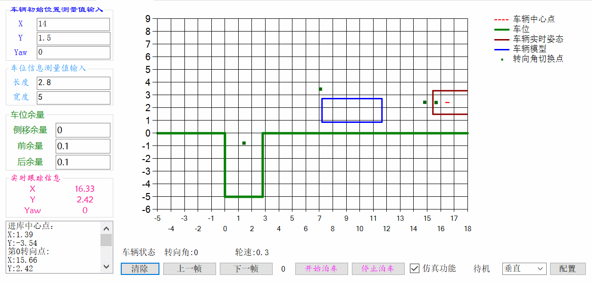

# APA_DebugAssistant
==this respository include the APA Debug Assistant==

we can use this assistant software to do Semi-physical simulation

下面是轨迹规划仿真的结果
##### 平行泊车
###### 一次入库
如下图所示，是平行车位一次入库的情形。当车位长度足够时，可以规划一段曲线，使车辆一次入库。

###### 多次尝试入库
如下图所示，是平行车位多次尝试入库的情形。当车位长度不满足一次入库条件时，可以在库内多次尝试，使车辆最终入库。

##### 垂直泊车
###### 垂直一次入库

###### 垂直一次尝试入库

###### 垂直多次尝试入库

###### 特殊情况处理
